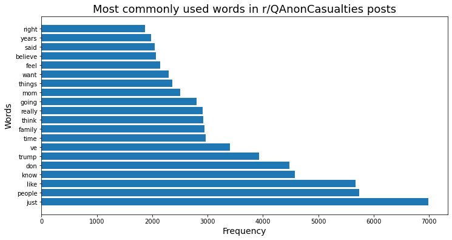
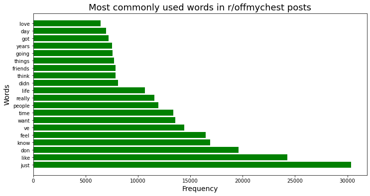

# Comparing Emotional Text in Subreddits Using NLP

## Executive Summary

With millions of posts and comments a day, Reddit is where people around the world go for news, commentary and community. Using Natural Language Processing, I was able to create a model that correctly identified the which of two subreddits a post was shared on 94.8% of the time. These results were then used to determine the differences and similarities between how people seek support and discuss emotional topics on these subreddits.

## Problem Statement

Reddit users who post to the r/OffMyChest and r/QAnonCasualties subreddits do so in order to share their experiences and find support. Using Natural Language Processing, create a model that can predict which subreddit a reddit post was posted in, and determine the differences between how people talk in each subreddit.

## Background 

In recent years, the [QAnon conspiracy theory](https://www.vox.com/2020/10/9/21504910/qanon-conspiracy-theory-facebook-ban-trump) has taken root in the U.S. Starting off as a fringe idea shared on 4chan message boards, one of its followers, who was the [first candidate to openly support the theory](https://www.theguardian.com/us-news/2020/nov/03/qanon-marjorie-taylor-greene-wins-congress) was elected to the House of Representatives in November 2020. 

In July 2019, [r/QAnonCasualties](https://www.reddit.com/r/QAnonCasualties/) was created as an online community where individuals with relatives and friends who have expressed support for the theories can gather for support and resources.

Almost a decade earlier, in October 2009, the [r/offmychest](https://www.reddit.com/r/offmychest/) subreddit was created as a space where people could find mutual support and share their experiences they can't tell those in their lives, whether it's something happy or something that's been weighing on them.

## Data Cleaning & EDA

While examining the data, there were a number of posts that were either null, or that only contained `[removed]` or `[deleted]`, all of which I dropped from the dataset. I also discovered a significant number of posts that contained variations of `QAnon` or `conspiracy` in them from the r/QAnonCasualties subreddit. Some of these values were also in the r/offmychest subreddit, but not to the same extent.

I created a function that would remove these values from the text and ran it on the combined dataframe with all of the text values for both subreddits so as to prevent the target from leaking into my X variable. 

Reviewing the most commonly used words in both subreddits, I found that people are more likely to use words related to the political right and their families in r/QAnonCasualties (e.g., 'trump', 'right', 'mom', 'family'), whereas people are more likely words related to those outside of their family in r/offmychest (e.g., 'people', 'friends'). Across both subreddits, people would use words related to their inner thoughts and feelings (e.g., 'know', 'feel', 'believe', 'want', 'think'). Below are graphs for each subreddit that shows the top words used in each. 

## Modeling

For the model, I tested Logistic Regression, Random Forests and K-Nearest Neighbors model to determine which one most accurately predicted which subreddit a post came from. Following this process, I found that the Logistic Regression model performed the best, with a ~95% accuracy between the train and the test data. 

The Random Forest model performed better on the train data (~99% accurate) and worse on the test data (~93% accurate), indicating that it was overfit to the training data and not a good model to use for this project. The K-Nearest Neighbors model performed worse than the Logistic Regression and Random Forest models on both the train (~78% accurate) and the test (~75% accurate) data. 

## Conclusion

From this process, I was able to create a model that accurately predicts which subreddit a post comes from, and found that there are some differences in how people discuss emotional topics and seek support on these subreddits, namely that those on r/QAnonCasualties are more likely to mention members of their family than those in the r/offmychest subreddit. 

## Next Steps

Future iterations of this project could gather posts over a longer time horizon to see if language differences have changed over time, as well as increase the number of n-grams and utilize different word tokenizers.